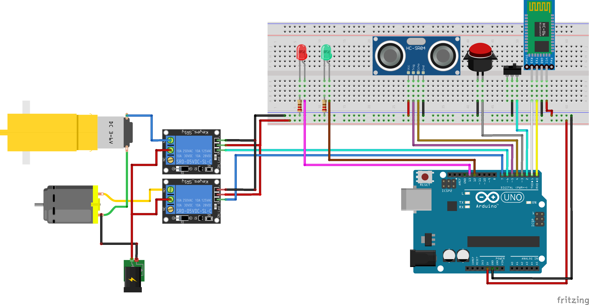

# Esteira Envasadora

Este é um código em linguagem de programação Arduino que controla um sistema de envase automático. O código usa um sensor ultrassônico para medir a distância de um recipiente que se move em uma esteira, e um conjunto de botões e sensores para controlar a operação do sistema. Quando o recipiente está na posição correta, o sistema enche o recipiente com um líquido e em seguida, a esteira avança para a próxima posição.

O código usa a biblioteca "EEPROM" para salvar o tempo de envase configurado pelo usuário. O código também usa a biblioteca "Ultrasonic" para controlar o sensor ultrassônico HC-SR04.

Existem algumas variáveis configuradas no início do código, incluindo os pinos usados para cada botão, sensor e atuador, bem como o tempo de envase padrão e um contador de quantos recipientes foram enchidos. O código verifica se o usuário salvou um tempo de envase anteriormente e usa esse valor, ou define o valor padrão de 10 segundos.

O código usa um loop para executar continuamente o processo de enchimento dos recipientes, verificando se um recipiente está presente no local correto usando um sensor de posição e medindo a distância do recipiente usando o sensor ultrassônico. Se um recipiente estiver presente, o sistema começa a encher o recipiente com um líquido e depois verifica se o recipiente está cheio. Se o recipiente estiver cheio, o sistema para de encher o recipiente e a esteira avança para a próxima posição. O código também verifica a entrada serial e atualiza o tempo de envase ou o contador de recipientes cheios, conforme necessário. O código usa o LED para indicar o status do sistema.

## Esquema de ligação

